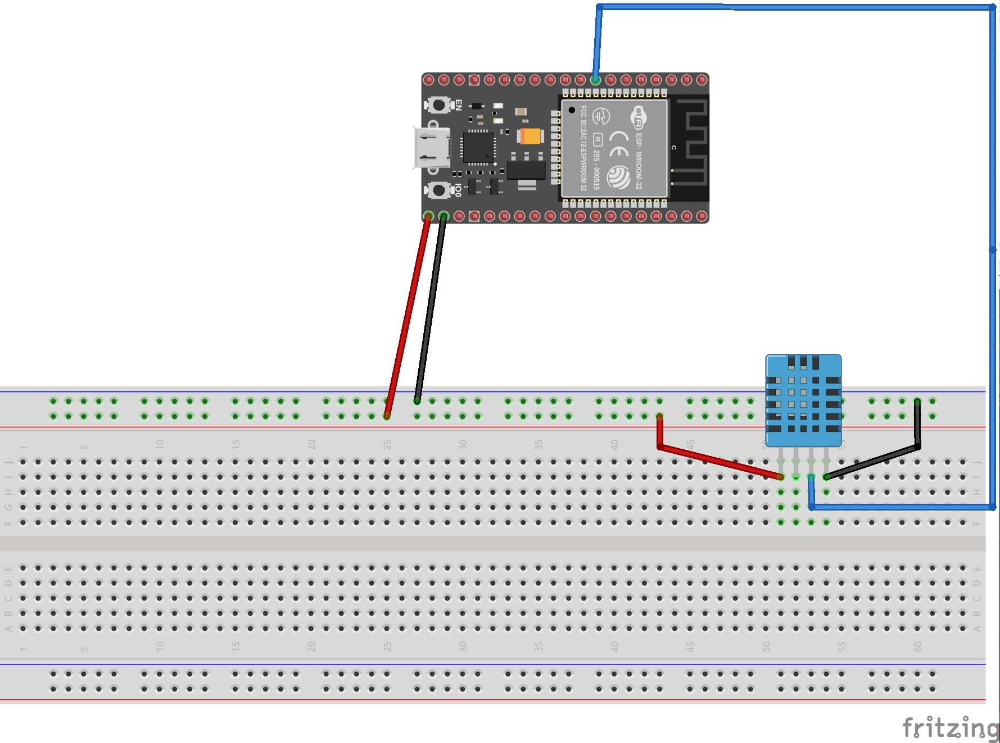
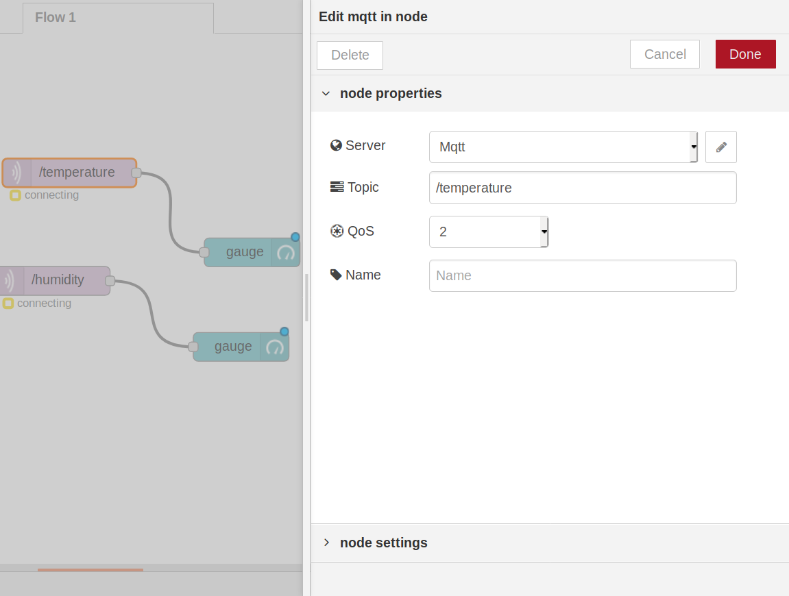

# Thermostat
Ce projet à été réalisé par [@WiLDCaT](https://github.com/wildcat7534); [@OlgaBd](https://github.com/olgaBd)

## Video :

## BIBLIOTHEQUE UTILISEE

#include <Adafruit_Sensor.h>
#include "DHT.h"
#include <WiFi.h>
#include "Adafruit_MQTT.h"
#include "Adafruit_MQTT_Client.h"
#include "uTimerLib.h"

## MATERIEL
- Bread Bord
- Carte ESP32
- DHT

## SCHEMA ELECTRIQUE

## NODE-RED

